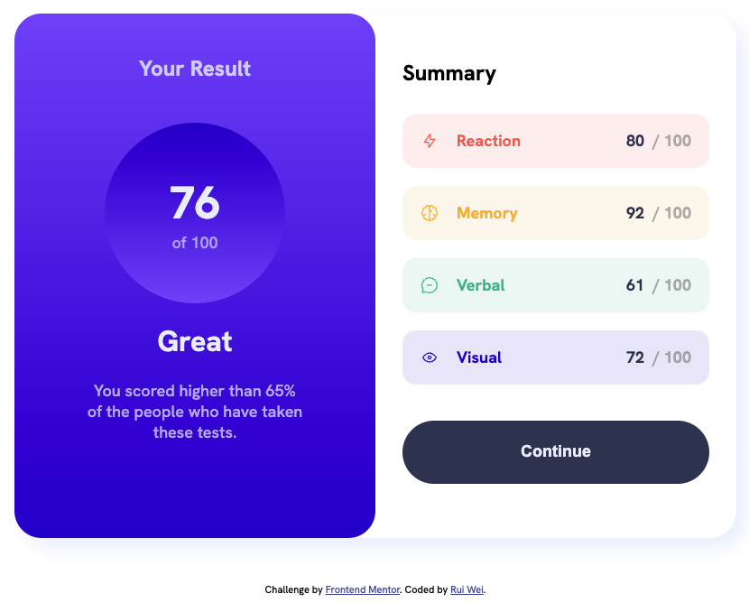
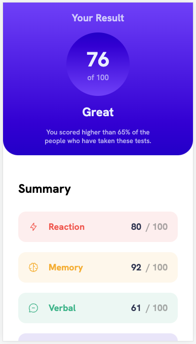

<div align="center">
  <h2>Results summary component solution</h2>
  <a href="https://www.frontendmentor.io/challenges/results-summary-component-CE_K6s0maV">Front End Mentor Challenge</a>
  <br>
  <br>
  
  
</div>


## Table of contents

- [Built with](#built-with)
- [Links](#links)
- [Screenshot](#screenshot)
- [PageSpeed Insights](#pagespeed-insights)
- [Challenges](#challenges)
- [What I learned](#what-i-learned)

**Note: Delete this note and update the table of contents based on what sections you keep.**

### Built with


### Links

- Live Site URL: [My live site](https://pangrwa.github.io/frontend-mentor-challenges/results-summary-component-main/index.html)

### Screenshot
<div align='center'>
  <h3>Desktop</h3>
    
  <h3>Mobile</h3>
    
</div>

### PageSpeed Insights
<div align='center'>
  <b>Overall score 95% for Both Mobile & Desktop</b><br>
  <br>
  <a href="https://pagespeed.web.dev/analysis/https-pangrwa-github-io-frontend-mentor-challenges-results-summary-component-main-index-html/nqsrrrlknq?form_factor=desktop">Click here for more information</a>
</div>

### Challenges
- Structuring of `CSS` code to prevent DRY. Should brainstorm on the project first
- Could not figure out why for mobile design, if i set `.body` height to `100vh` instead of `100%` it would result in some of my content getting pushed up and hence the top content gets hidden away.
```css
@media (max-width: 600px) {
    body {
        margin: 0px;
        height: 100%;
    }
    ...
}
```

### What I learned
- Structure the `html` code with appropiate `html` elements/tags
- Learnt that mobile-first design is recommended
